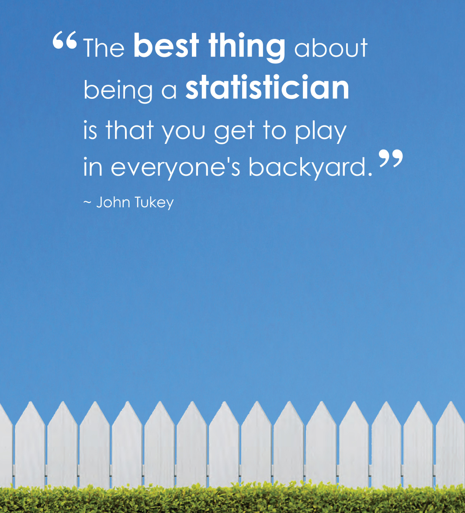
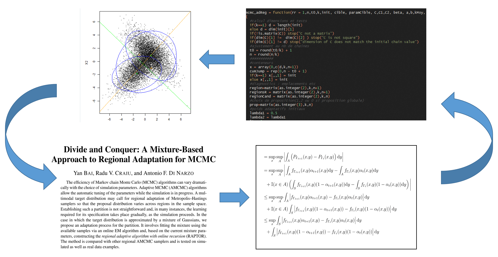
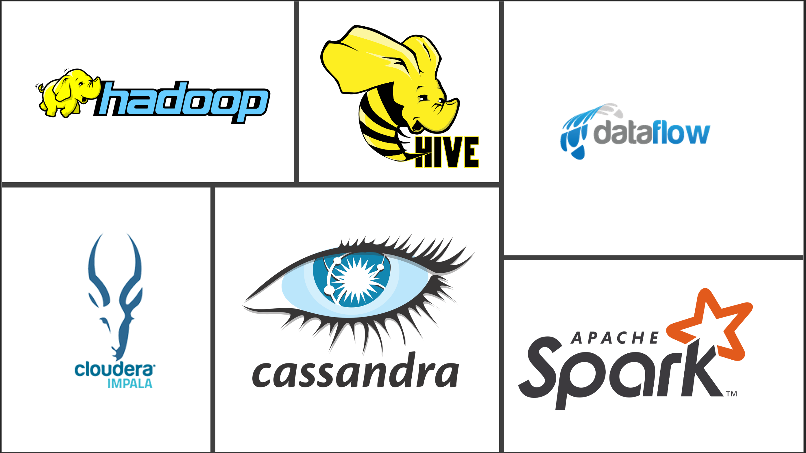

In a few weeks, I'll be invited by McGill university to a data science career Q&A session. And for the first time in my short life, I'll be the one providing the A's. To help in my preparation, the organizers kindly sent me a list of question prompts, the first of these being:

> *Can you describe your career path, what you currently do?*

I thought it would be interesting to provide a longer, written, answer to this, as it felt like a good time to reflect upon the road travelled since my first step on the data science road seven years ago. Additionally, what a better way to finally get that blog of mine started? So here it goes!

Education
---------

I won't elaborate at this time on what preceded my data science career. Let's just say that after a short but exciting few years as a freelance composer, arranger and orchestrator, I decided to go back to school to complete an undergrad math degree at the age of 26. This was in 2013, at a time when the AI and big data trends were getting quite... big, but not mainstream news material like they are now. In fact, the term data scientist had just made its [first big hit](https://hbr.org/2012/10/data-scientist-the-sexiest-job-of-the-21st-century).

Some key milestones from my studies:

-   A few days in, I was convinced to take the statistics specialization, mostly on the back of a very convincing speech from a stats professor, plus a compelling quote/poster that was travelling around at the time, and which resonated strongly with me:

<table style="width:7%;">
<colgroup>
<col width="6%" />
</colgroup>
<thead>
<tr class="header">
<th align="center"></th>
</tr>
</thead>
<tbody>
<tr class="odd">
<td align="center"><em>Also note that the fence is low enough to quite easily jump from one backyard to the next.</em></td>
</tr>
</tbody>
</table>

My first contact with programming was during my second semester. It was a revelation, and greatly broadened my conception of what was possible to do with your humble PC. From there, I took all the optional computer science credits that my degree permitted, which amounted to almost a third of my classes. Needless to say, this prepared me well for my future DS job.

-   After my second year, I had a summer undergrad research scholarship, which was on MCMC methods applied to climate forecast. What I liked most about this academic episode was the healthy mix of article reading, theoretical work, programming, experimentation through simulation and data visualization. This balanced work flow felt so good, especially compared to the learn this-take exam paradigm of your typical undergrad semester. At that point, I knew that I would need such a diverse work agenda to be happy later on in any field.

|                  |
|:------------------------------------------------------------:|
| *If this is not a balanced life style, I don't know what is* |

As a bonus, the research went very well. I was lucky enough to not just *search* but also *find* a little something that would lead to a [publication](https://onlinelibrary.wiley.com/doi/abs/10.1002/cjs.11562?af=R) many years later. This fuelled enough curiosity for me to pursue with a masters degree in statistics.

-   On paper, I totally nailed the master degree, but the first year of course work left me exhausted. The thesis part went really well, mostly because I was still banking on the neat little finding from my undergrad research. Still, it was clear that I wouldn't go farther down the academic lane for a time.

> Me: Wow, we finally got that thing published... after having to add a whole new example, re-write two sections from scratch, being rejected once, going through two rounds of revisions... Is it always that complicated?

> Supervisor: This one was actually one of the easiest publication processes I ever had.

> Me: (okay, I'm out.)

Getting a job
-------------

My entry job in the field happened through a strange coincidence. A few weeks before I submitted my thesis, my supervisor got a phone call from a data science team lead at Ubisoft Montreal, saying he was looking for smart people, whatever that was supposed to mean. Curious more than anything else, I contacted him and sent my resume. Upon reading the actual job offer, I was quite convinced that I would not make it, there were just all of these requirements about technologies that I had never heard about.

<table style="width:7%;">
<colgroup>
<col width="6%" />
</colgroup>
<thead>
<tr class="header">
<th align="center"></th>
</tr>
</thead>
<tbody>
<tr class="odd">
<td align="center"><em>I could guess that the first two were related, but otherwise didn't have clue what these were!</em></td>
</tr>
</tbody>
</table>

As it turns out, the interview was not focused at all on what I did or didn't know, but rather on assessing how well I mastered the stuff that I did claim to know. They also asked some questions on one or two business-oriented problems and me made me talk about relatively basic topics like linear regression and probability distributions, and that was it.

By the end of the interview, I understood what my future boss meant by smart. He was basically looking for someone with a good numeric grasp on things. Someone that had the ability learn stuff and acquire skills quickly, in a mostly autonomous fashion. And also, someone wise enough to understand the skills they lacked and acquire them. It seems that I was the closest thing to this description they had found, as a few days later, I got an offer. This was in July 2018.

Fast forward to fall 2020, I have now just been promoted to the lead position of my data science team. It's very scary and exciting all at once, and I'm looking forward to finding the next smart person to join our team.

What I do
---------

Like any data scientist, my general mandate is to acquire and manipulate data to create knowledge and generate added value.

In a video game company like Ubisoft, the bulk of our data comes from our in-game tracking systems. Most of what the players do in the game, transactions, task completions, interactions, are tracked and stored in our database. This data is also supplemented by more qualitative data from surveys and external user tests.

It can then be used for many tasks:

-   Evaluate a certain feature or mechanic in terms of fairness, usability, appreciation.
-   Formulate recommendations on future content development.
-   Implement automatic machine learning solutions. Use cases include activity forecasts and recommendation of in-game content based on a given player's characteristics.

My team and I are also to a certain extent the go-to math people in the studio, which makes us handy consultants in the implementation of new game systems, like skill rating, matchmaking, in-game economy rules, point systems and more. We are often called upon to mathematically optimize such systems in the light of the design objectives. We then extensively test by simulation the behaviour of our solutions, prior to their live implementation.

Besides these more technical components, communication is also a key aspect. A significant share of my time is spent in meetings, disclosing results and advancement updates, sharing insights and good practices from one production to another, and finding interested stakeholders for R&D endeavours.

Finally, like anyone in the field, I spend an embarrassing part of my time cleaning and wrestling with data tables, and I'm afraid you will too.

### Tools of the trade

In terms of daily tools, they are the usual DS arsenal Data manipulation through SQL, pyspark, tidyverse Data exploration and simulation with Python and R Machine learning algorithms, supervised and unsupervised, mostly with sklearn General statistical inference, frequentist and Bayesian A bit of deep learning And of course, Excel, Powerpoint, Confluence and so on.

Closing words
-------------

Thanks for reading, I hope you were able to get something useful out of this. I'll to try to be back quickly with my run-down of the other more specific prompts.
